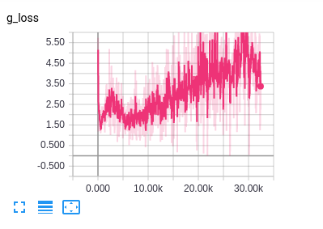
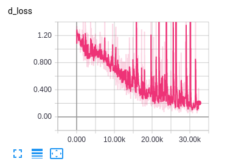

# AnimeGAN

Generating Anime Faces with a Conditional Generative Adversarial Network in Pytorch.

### Purpose

Try out Pytorch with Tensorboard and a new technique - Spectral Normalization.

### Dataset

Used a scrapped anime dataset from my ADLxMLDS 2017 course.

### Training Progress

Generator Loss

Discriminator Loss

### Results

| 30000 iterations | 5000 iterations Spectral Normalization |
| :--------------: | :------------------------------------: |

 |
